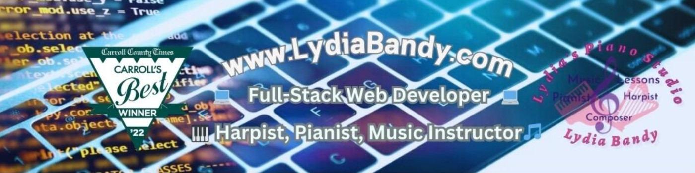

<!--
**LydiasPianoStudio/LydiasPianoStudio** is a ✨ _special_ ✨ repository because its `README.md` (this file) appears on your GitHub profile.

Here are some ideas to get you started:
- 👯 I’m looking to collaborate on ...
- 🤔 I’m looking for help with ...

- 📫 How to reach me: ...
- 😄 Pronouns: ...
- ⚡ Fun fact: ...
-->
## Howdy! I'm Lydia Bandy 👋

- 🎹 CEO & Owner/founder of [LydiasPianoStudio.com](https://www.lydiaspianostudio.com)
- 🎵 Professional harpist & pianist: [Check out my performances on YouTube!](https://www.youtube.com/channel/UCjNLzm0W-ojlrSBowuwMhQg)
- 🎶 Listen to my album "Piano Pearls" on [Spotify](https://open.spotify.com/artist/52xxPzgfdnhflFnTu5g0OY?si=ZEsbXdQqSI6NRsi5f_Nuog)
- 🎲⚔🗡🐲 Enjoy playing D&D weekly, "The Misadventuring Party", on [Twitch](https://m.twitch.tv/themisadventuringparty/home)
- 💬 Ask me about similarities in music theory 🎵 and coding languages 💻
- 🔭 Check out my chatbot clone: "Johnny 5"🤖: [My MERN Stack Chatbot Clone](https://github.com/LydiasPianoStudio/MERN-AI-ChatBot-App)
- 🌱 Proficient in JavaScript, TypeScript, Node.js, React.js, MongoDB, SQL, and Python.
- 💻 Web development and consultant: [Albert Bandy](https://albertbandy.com)
- 💬 "My sales have doubled for my woodworking projects thanks LydiasPianoStudio for developing my website!" ~Albert Bandy
- 👨‍💻⌨🖱 I like to contribute to open sources and collaborate on exciting projects ✍ 😄
- 💼 Full-Stack Software Engineer. Here is my [Resume](https://www.kickresume.com/cv/gNExlK/) 📃 
- 📫 How to reach me: [Lydia Bandy LinkedIn](https://www.linkedin.com/in/lydia-bandy-2b160745/)
